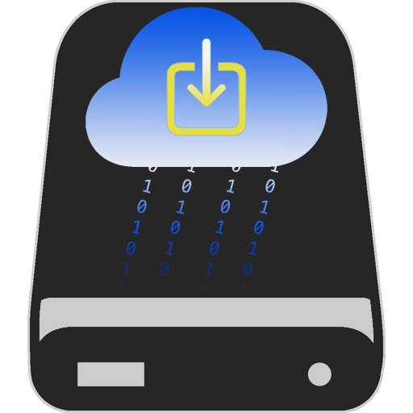

<div align="center" markdown="1">

[]()

# Drive Backup

### A simple way to backup your Google Drive locally.

[](https://pypi.org/project/drive-backup/)
[](https://github.com/dunkmann00/Drive-Backup-Credentials/releases/latest)
[](https://pypi.org/project/drive-backup/)
[](https://github.com/dunkmann00/Drive-Backup/actions/workflows/build.yml)
[](https://github.com/dunkmann00/Drive-Backup/actions/workflows/github_pages.yml)
[](LICENSE.md)

</div>

## Introduction

If you need to backup your Google Drive this is exactly the tool for you. It
will fetch the files and folders you want to backup from your Google Drive and
store them locally.


## Notable Features

- Supports backing up either your entire Google Drive or a specific directory.
- **FAST**, Drive Backup will first check if a file it wants to download was
  already downloaded in a previous backup.
- Works through Google Drive API which uses OAuth 2.0 and sends all data
  securely over HTTPS.
- Supports both Mac, Windows, & Linux.
- Emits a notification when complete or when there is a problem (Mac & Windows
  only).
- Choose between 3 backup types:
  - complete
    - Creates a new backup, leaving previous backup untouched.
  - increment
    - Creates a new backup, moving files that have not changed since the
      previous backup into the new backup, and leaving only old files remaining
      in the previous backup.
  - update
    - Update the previous backup in-place with the latest changes from your
      Google Drive.
- Convert Google Document files (Docs, Sheets, Slides) into their corresponding
  MS Office type or to PDF.
- Supports shortcuts in your Google Drive. It will treat a shortcut like a
  separate file each time it encounters one.
- Creates a log file with every backup so you can verify all your files were
  downloaded or check for errors to get information why something went wrong or
  didn't download.
- Saves the configuration for each backup in a `bkp` file so you can easily run
  the same backup multiple times.

## Installation

Drive Backup requires Python version 3.11 or higher.

There are a few different ways to install Drive Backup and depending on your
setup/need all of them are equally viable.

### Prebuilt Binaries

Download the prebuilt binaries from the
[latest release](https://github.com/dunkmann00/Drive-Backup-Credentials/releases/latest).

### Via `pipx`

```bash
pipx install drive-backup
```

### Via `git clone`

After cloning the repo make sure to install the project with poetry
(`poetry install`). If you don't have poetry installed on your system you can
find info on how to install it on their
[docs](https://python-poetry.org/docs/#installation). From this point it is like
any other poetry project:

```bash
poetry run dbackup ...
```

## Usage

The first time Drive Backup is ran (or whenever there is no valid user signed
in), a browser window will open asking you to sign in to Google and to give
Drive Backup permission to download files from Google Drive.

Below are some common examples to show how Drive Backup works. To see more info
about all of the options and commands run `dbackup -h` or `dbackup [command] -h`
.

Backup your entire Google Drive into the current directory. Drive Backup will
make a directory in your current directory titled `Google Drive Backup {date}`
where `date` is the current date.
```bash
dbackup backup
```

Backup your entire Google Drive into a specific directory titled `my-backups`:
```bash
dbackup backup -d my-backups
```

Backup only the directory on Google Drive called `Vacation Photos` into
`my-backups` and run an `update` type backup.
```bash
dbackup backup -d my-backups -t update --source "Vacation Photos"
```

If you wanted to rerun a previous backup, you can pass in the backup config file
from that backup and all the same settings will be used. By default the
`drive-backup.bkp` file from a backup is stored in the destination directory.

As an example, lets say more photos were added to our `Vacation Photos`
directory on Google Drive and we want to back them up. We don't need to use the
`-t` or `--source` options again, just `-c`.
```bash
dbackup backup -c my-backups/drive-backup.bkp
```

When downloading many files, the log can get cluttered with both Drive Backup's
logging of file info and the underlying Google library's logging of download
info. For this reason it may be desirable to only log messages from Drive
Backup and filter out the rest.
```bash
dbackup backup --log-filter
```

Similarly, you may only want to record logs of files that need to be downloaded,
not files that are already present (or in other words, not files that were
downloaded on a previous backup).
```bash
dbackup backup --log-changes
```

You can sign out of your account so you can sign into a different Google
account.
```bash
dbackup user sign-out
```

You can also check which user is currently logged in.
```bash
dbackup user info
```

### Custom Client Credentials

If you are having problems with Drive Backup and are hitting download limits,
you can supply your own client credentials. To generate you own, check out the
[Authorize credentials for a desktop application](https://developers.google.com/drive/api/quickstart/python#authorize_credentials_for_a_desktop_application)
section on the Google Drive Python API Guide page. Once you have followed the
steps and downloaded the json file, pass it into Drive Backup with the
`--client-credentials` flag when you run a backup. Now Drive Backup will use
your client credentials instead of the default one that ships with the tool.
Note that this will get stored in the backup config `bkp` file, so if you are
repeating a backup with `--backup-config` you don't need to explicitly pass the
custom client credential each time.

```bash
dbackup backup --client-credentials path/to/your/personal/credentials.json
```

## Copyright and License

Google Drive is a trademark of Google Inc. Use of this trademark is subject to
Google Permissions.

2024 George Waters under the MIT License. See [LICENSE](LICENSE.md) for details.
